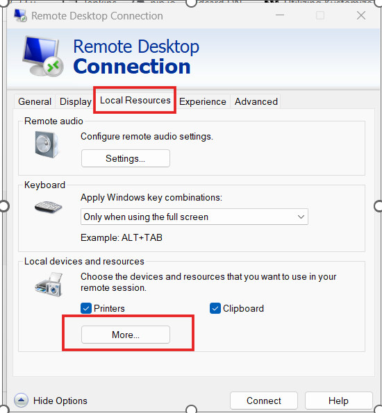

**File Sharing From RDP:**

1.  On your windows laptop, open RDP:

Win + R -\> RDP -\> Local Resources -\> Check drives

2.  Now, you can copy any file on your Windows to your windows VM.

1.  Windows VM

2.  Open PowerShell in windows VM.

3.  Install Azure CLI.

winget install --exact --id Microsoft.AzureCLI

4.  Check the azure cli status

az version

5.  Login to Azure

az login

6.  Install terraform on your windows VM.

winget install --exact --id Hashicorp.Terraform

7.  Verify you are connected to the correct Azure subscription.

az account show --output table

8.  Create your terraform project folder.

mkdir C:\terraform-lab

cd C:\terraform-lab

9.  Check where you are right now:

pwd

10. Make the first terraform file -\> main.tf

notepad main.tf

terraform {

required_providers {

azurerm = {

source = "hashicorp/azurerm"

version = "~\> 4.0"

}

}

}

provider "azurerm" {

features {}

}

resource "azurerm_resource_group" "demo" {

name = "rg-terraform-demo"

location = "East US"

}

Run these commands:

terraform fmt

Terraform init

Initializing the backend...

Initializing provider plugins...

Installing hashicorp/azurerm...

Terraform has been successfully initialized!

terraform validate

terraform plan ----\> What terraform will do??

terraform apply:

Now, you will see another file --\> terraform.tfstate

main.tf

↓

Desired infrastructure

terraform.tfstate

↓

Terraform's record of managed infrastructure

Azure

↓

Actual infrastructure

See, what terraform knows:

terraform state list:

----\> See the resource details:

terraform state show azurerm_resource_group.demo

terraform plan

Now, add these two blocks in the main.tf.

resource "azurerm_virtual_network" "demo_vnet" {

name = "vnet-terraform-demo"

location = azurerm_resource_group.demo.location

resource_group_name = azurerm_resource_group.demo.name

address_space = \["10.0.0.0/16"\]

}

resource "azurerm_subnet" "app_subnet" {

name = "subnet-app"

resource_group_name = azurerm_resource_group.demo.name

virtual_network_name = azurerm_virtual_network.demo_vnet.name

address_prefixes = \["10.0.1.0/24"\]

}

Now, terraform fmt

terraform validate

terrafrom plan

terraform apply

Confirm there are no changes.

**What's the idea?**

We're separating **values** from the infrastructure definition:

terraform.tfvars\
↓\
VALUES\
↓\
variables.tf\
↓\
main.tf\
↓\
Azure

So instead of hardcoding in main.tf.

----\>\>\> Then move to building variables and outputs.

Create a variables.tf.

variable "resource_group_name" {

description = "Name of the Azure resource group"

type = string

}

variable "location" {

description = "Azure region"

type = string

default = "East US"

}

variable "vnet_name" {

description = "Name of the virtual network"

type = string

}

variable "vnet_address_space" {

description = "Address space for the virtual network"

type = list(string)

}

variable "subnet_name" {

description = "Name of the application subnet"

type = string

}

variable "subnet_address_prefix" {

description = "Address prefix for the application subnet"

type = string

}

And for values of these variables, create terraform.tfvars.

notepad terraform.tfvars

resource_group_name = "rg-terraform-demo"

location = "East US"

vnet_name = "vnet-terraform-demo"

vnet_address_space = \["10.0.0.0/16"\]

subnet_name = "subnet-app"

subnet_address_prefix = "10.0.1.0/24"

Now, modify the main.tf:

Replace the three blocks with:

resource "azurerm_resource_group" "demo" {

name = var.resource_group_name

location = var.location

}

resource "azurerm_virtual_network" "demo_vnet" {

name = var.vnet_name

location = azurerm_resource_group.demo.location

resource_group_name = azurerm_resource_group.demo.name

address_space = var.vnet_address_space

}

resource "azurerm_subnet" "app_subnet" {

name = var.subnet_name

resource_group_name = azurerm_resource_group.demo.name

virtual_network_name = azurerm_virtual_network.demo_vnet.name

address_prefixes = \[var.subnet_address_prefix\]

}

Now create outputs file:

notepad outputs.tf

output "resource_group_name" {

description = "Name of the resource group"

value = azurerm_resource_group.demo.name

}

output "vnet_name" {

description = "Name of the virtual network"

value = azurerm_virtual_network.demo_vnet.name

}

output "subnet_name" {

description = "Name of the application subnet"

value = azurerm_subnet.app_subnet.name

}

Run terraform apply

--\>\> terraform apply is the normal way to persist the output value
into state.

Now, you can clearly see the outputs.

Output.tf is basically creating a **named, convenient way to retrieve
important Terraform values**.

Absolutely. 👍 You've now covered the basic local-state workflow, so
this is the **right point** to move to remote state and state locking.

The key is: **don't just memorize state locking—let's configure it
hands-on in Azure.**

**1. First understand what we're changing**

Right now your setup is approximately:

Your PC\
│\
├── main.tf\
├── variables.tf\
├── terraform.tfvars\
├── outputs.tf\
│\
└── terraform.tfstate ← LOCAL STATE

Your terraform.tfstate is currently sitting on your computer.

Terraform uses this state to remember:

Azure Resource Terraform State\
────────────────────────────────────────────\
Resource Group ←→ azurerm_resource_group.demo\
VNet ←→ azurerm_virtual_network.demo_vnet\
Subnet ←→ azurerm_subnet.app_subnet

**The problem with local state**

Imagine two DevOps engineers:

terraform.tfstate\
│\
┌─────────┴─────────┐\
↓ ↓\
Engineer A Engineer B\
laptop laptop

They don't naturally share the same state file.

That's a problem for a team.

**2. Remote state**

Instead, we can store the state centrally in Azure:

Azure Storage\
│\
terraform.tfstate\
│\
┌─────────┴─────────┐\
↓ ↓\
Engineer A Engineer B\
│ │\
└──── Terraform ───┘

Now everyone works against the **same state**.

For Azure, we'll use:

**Azure Storage Account → Blob Container → Terraform state file**

Conceptually:

Azure\
│\
└── Storage Account\
│\
└── Blob Container\
│\
└── terraform.tfstate

**3. Where does state locking come in?**

This is the really important part.

Suppose Engineer A runs:

terraform apply

At the same time Engineer B runs:

terraform apply

Without locking:

Engineer A ──→ reads state\
Engineer B ──→ reads state\
\
Engineer A ──→ modifies infrastructure\
Engineer B ──→ modifies infrastructure\
\
💥 possible state conflict

With state locking:

Engineer A ──→ 🔒 LOCK\
│\
↓\
terraform apply\
│\
↓\
unlock\
\
Engineer B ──→ waits / gets lock error

So the important distinction is:

**Remote state**

**Where is the state stored?**

Azure Storage

**State locking**

**How do we prevent multiple Terraform operations from modifying the
same state simultaneously?**

Lock mechanism

They solve related but different problems.

**4. What we're going to build**

We'll modify your lab to become:

C:\terraform-lab\
│\
├── main.tf\
├── variables.tf\
├── terraform.tfvars\
├── outputs.tf\
│\
└── backend.tf\
│\
↓\
Azure Storage Account\
│\
↓\
Blob Container\
│\
↓\
terraform.tfstate

And then Terraform will use:

Azure Blob Storage\
+\
state locking

instead of your local:

terraform.tfstate

**5. But there's an important catch**

Your backend itself needs an Azure Storage Account.

And this creates a classic Terraform problem:

**How do we create the storage account that will store Terraform's
state?**

We don't want Terraform's own state to depend on the state we're trying
to create.

For learning purposes, we'll create the backend storage **first**,
separately, and then configure Terraform to use it.

So our sequence will be:

STEP 1\
Create Azure Storage Account\
↓\
STEP 2\
Create Blob Container\
↓\
STEP 3\
Create backend.tf\
↓\
STEP 4\
terraform init\
↓\
STEP 5\
Terraform migrates local state\
↓\
STEP 6\
Verify remote state\
↓\
STEP 7\
Understand/test locking

**Let's start with Step 1**

Before creating anything, I want you to check whether you already have
an Azure Storage Account that we can use for this lab.

Run:

az storage account list --output table

Perfect. 👍 This tells us you **already have one Storage Account**, but
it belongs to the Azure Cloud Shell infrastructure:

Name: cs210032003c11b7c16\
Resource Group: cloud-shell-storage-eastus\
Location: eastus

I **would not use this one** for your Terraform backend because it's
Cloud Shell's storage account. Let's create a separate, dedicated
storage account for your Terraform state.

**Step 2 — Create a dedicated Resource Group for the backend**

We're going to keep your existing Terraform resources untouched.

Run:

az group create --name rg-terraform-backend --location eastus

You should get JSON containing something like:

"provisioningState": "Succeeded"

This resource group will contain the **Terraform backend storage**, not
your application infrastructure.

So eventually you'll have:

Azure\
│\
├── rg-terraform-demo ← your existing Terraform resources\
│ ├── VNet\
│ └── Subnet\
│\
└── rg-terraform-backend ← NEW\
└── Storage Account\
└── tfstate container\
└── terraform.tfstate

**Step 3 — Create the Storage Account**

Run:

az storage account create --name tfstate\$(Get-Random) --resource-group
rg-terraform-backend --location eastus --sku Standard_LRS --kind
StorageV2

**What this command means**

az storage account create\
↓\
Create an Azure Storage Account\
\
--name\
↓\
Give it a unique name\
\
--resource-group rg-terraform-backend\
↓\
Put it in our backend resource group\
\
--location eastus\
↓\
Store it in East US\
\
--sku Standard_LRS\
↓\
Standard locally redundant storage

The \$(Get-Random) part makes the name unique, because **Azure Storage
Account names must be globally unique**.

Eventually, the terraform architecture !!!

Azure

│

┌───────────┴───────────┐

│ │

rg-terraform-demo rg-terraform-backend

│ │

Your resources Storage Account

├── VNet │

└── Subnet Blob Container

│

Terraform.tfstate

-----\> A **blob** is simply a piece of data stored in **Azure Blob
Storage**.

The word **BLOB** originally means **Binary Large Object**.

Think of it as a file system.

---\> A **container** is like a folder/bucket that organizes blobs.

See the storage account name.

az storage account list --resource-group rg-terraform-backend --output
table

tfstate1730927681

--\> If you want the exact name

az storage account list --resource-group rg-terraform-backend --query
"\[\].name" --output tsv

---\> Create a container which stores the terraform state file.

az storage container create --name tfstate --account-name
tfstate1730927681 --auth-mode login

**-------\> Create backend.tf ---\> Telling Terraform to use this
storage instead of your local terraform.tfstate.**

**backend.tf**

terraform {

backend "azurerm" {

resource_group_name = "rg-terraform-backend"

storage_account_name = "tfstate1730927681"

container_name = "tfstate"

key = "terraform.tfstate"

}

}

--\> Verify the remote migration.

terraform init

This is a very important command in this exercise, because Terraform
will detect that you're moving from local state to an Azure remote
backend.

The real verification is to see the Azure Storage:

az storage blob list --account-name tfstate1730927681 --container-name
tfstate --auth-mode login --output table

Not working : --\> Permission issue

--\> terraform plan

--\> terraform state list

--\> terraform state pull

It is giving the json output.

Verify the backend configuration on Azure Portal as well.

**----\>\< State locking test... -----\>**

Since your AzureRM backend is already initialized successfully, we’ll
test whether Azure Blob Storage prevents two Terraform operations from
modifying the state at the same time.

Step 1 — Open TWO PowerShell windows

Keep both in:

C:\terraform-lab

Step 2 — PowerShell Window 1

Run:

terraform apply

When you see:

Do you want to perform these actions?\
Enter a value:

DON'T type yes yet.

Leave this window waiting at the approval prompt.

Step 3 — PowerShell Window 2

Open another PowerShell and run:

cd C:\terraform-lab\
terraform apply

Now Window 2 should attempt to acquire the same Terraform state lock.

You should see something similar to:

Acquiring state lock. This may take a few moments...

and eventually an error like:

Error acquiring the state lock\
\
Error message: ...\
Lock Info:\
ID: ...\
Path: ...\
Operation: OperationTypeApply\
Who: ...

What this proves

Your backend:

Azure Blob Storage\
↓\
terraform.tfstate\
↓\
State Lock

is preventing concurrent Terraform operations.

So if two engineers accidentally run terraform apply against the same
infrastructure at the same time, Terraform won't let both modify the
state simultaneously.

Don't run terraform force-unlock for this test. We want to observe the
lock first.

**On window 1 :**

terraform apply -lock-timeout=60s

**On windows 2:**

Run

terraform apply -lock-timeout=10s

---\> Complete terraform flow:

Terraform Configuration

(.tf files)

→ Variables

→ Resources

→ Resource References

→ Outputs

→ terraform init

→ terraform fmt

→ terraform validate

→ terraform plan

→ terraform apply

→ Azure Resources

→ Terraform State

→ Remote Backend (Azure Blob)

→ State Locking

→ terraform destroy

**Create AKS cluster with Terraform:**

Perfect 👍 Let's build it step-by-step. We'll create a **modular AKS
cluster** and understand what we're doing rather than blindly copying
code.

cd C:\\

mkdir terraform-aks

cd terraform-aks

mkdir modules

mkdir modules\resource-group

mkdir modules\aks

**Step 1 — Create providers.tf**

Inside:

C:\terraform-aks

create:

providers.tf

Put this in it:

terraform {\
required_providers {\
azurerm = {\
source = "hashicorp/azurerm"\
version = "~\> 4.81"\
}\
}\
}\
\
provider "azurerm" {\
features {}\
}

**What this does**

terraform block\
↓\
Tells Terraform which provider we need\
↓\
AzureRM provider\
↓\
Azure resources can now be managed

We're using the same AzureRM provider version you already worked with.

**Step 2 — Create the Resource Group module**

Go to:

C:\terraform-aks\modules\resource-group

Create:

main.tf\
variables.tf\
outputs.tf

**modules/resource-group/variables.tf**

variable "resource_group_name" {\
type = string\
}\
\
variable "location" {\
type = string\
}

**modules/resource-group/main.tf**

resource "azurerm_resource_group" "this" {\
name = var.resource_group_name\
location = var.location\
}

**modules/resource-group/outputs.tf**

output "resource_group_name" {\
value = azurerm_resource_group.this.name\
}\
\
output "resource_group_location" {\
value = azurerm_resource_group.this.location\
}

So this module is basically:

Input\
↓\
resource_group_name\
location\
↓\
Resource Group\
↓\
Outputs

**Step 3 — Call this module from the root**

Now go back to:

C:\terraform-aks

Create:

main.tf

Add:

module "resource_group" {\
source = "./modules/resource-group"\
\
resource_group_name = "rg-terraform-aks"\
location = "East US"\
}

Notice what happened here.

We didn't create the resource directly in the root.

Instead:

main.tf\
↓\
module "resource_group"\
↓\
modules/resource-group/main.tf\
↓\
azurerm_resource_group

That's the key idea behind **Terraform modules**.

**Step 4 — Create the AKS module**

Now go to:

C:\terraform-aks\modules\aks

Create:

main.tf\
variables.tf\
outputs.tf

**variables.tf**

variable "aks_name" {\
type = string\
}\
\
variable "location" {\
type = string\
}\
\
variable "resource_group_name" {\
type = string\
}\
\
variable "dns_prefix" {\
type = string\
}\
\
variable "node_count" {\
type = number\
default = 1\
}\
\
variable "vm_size" {\
type = string\
default = "Standard_B2s"\
}

**main.tf**

resource "azurerm_kubernetes_cluster" "this" {\
name = var.aks_name\
location = var.location\
resource_group_name = var.resource_group_name\
dns_prefix = var.dns_prefix\
\
default_node_pool {\
name = "system"\
node_count = var.node_count\
vm_size = var.vm_size\
}\
\
identity {\
type = "SystemAssigned"\
}\
}

**outputs.tf**

output "aks_name" {\
value = azurerm_kubernetes_cluster.this.name\
}\
\
output "aks_id" {\
value = azurerm_kubernetes_cluster.this.id\
}\
\
output "kube_config" {\
value = azurerm_kubernetes_cluster.this.kube_config_raw\
sensitive = true\
}

**Step 5 — Call the AKS module**

Go to the root:

C:\terraform-aks

Open main.tf.

It should now contain:

module "resource_group" {\
source = "./modules/resource-group"\
\
resource_group_name = "rg-terraform-aks"\
location = "East US"\
}\
\
module "aks" {\
source = "./modules/aks"\
\
aks_name = "aks-terraform-demo"\
location = module.resource_group.resource_group_location\
resource_group_name = module.resource_group.resource_group_name\
dns_prefix = "aksterraformdemo"\
\
node_count = 1\
vm_size = "Standard_B2s"\
}

**⭐ This is the important part**

Look at:

location = module.resource_group.resource_group_location

and:

resource_group_name = module.resource_group.resource_group_name

That's a **module output being used as an input to another module**.

So:

Resource Group Module\
│\
├── resource_group_name\
│\
└── resource_group_location\
│\
↓\
AKS Module\
│\
↓\
AKS Cluster

That's exactly the kind of **module + reference + dependency**
relationship you want to understand for real Terraform work.

**Step 6 — Root outputs**

Create:

outputs.tf

in:

C:\terraform-aks

Add:

output "resource_group_name" {\
value = module.resource_group.resource_group_name\
}\
\
output "aks_name" {\
value = module.aks.aks_name\
}

Your final structure should now be:

C:\terraform-aks\
│\
├── providers.tf\
├── main.tf\
├── outputs.tf\
│\
└── modules\
│\
├── resource-group\
│ ├── main.tf\
│ ├── variables.tf\
│ └── outputs.tf\
│\
└── aks\
├── main.tf\
├── variables.tf\
└── outputs.tf

**🚦 Don't apply yet**

Now run:

terraform init

Then:

terraform fmt -recursive

Then:

terraform validate

Then:

terraform plan

**Stop after terraform plan and send me the output.** We'll check the
AKS plan together before creating anything.

Yes — **both are excellent questions**, and they connect directly to
what you just learned.

**1. Why do we use Terraform modules?**

A **module is a reusable package of Terraform configuration**.

Without modules, you might have everything in one big main.tf:

main.tf\
├── Resource Group\
├── VNet\
├── Subnets\
├── NSG\
├── AKS\
├── Key Vault\
└── Storage Account

As the infrastructure grows, that becomes difficult to manage.

With modules:

Root Module\
│\
├── Resource Group Module\
├── Network Module\
├── AKS Module\
└── Key Vault Module

Each module has a **specific responsibility**.

**The biggest reason: reusability**

Suppose you create an AKS module:

modules/\
└── aks/\
├── main.tf\
├── variables.tf\
└── outputs.tf

You can use it for different environments:

Dev → AKS module → 1 node\
QA → AKS module → 2 nodes\
Prod → AKS module → 3+ nodes

You don't have to rewrite the AKS resource each time.

You simply provide different variables.

**Think of it like this:**

MODULE = reusable Terraform building block

For example:

AKS Module\
↑\
│ variables\
│\
Dev ───────┐\
QA ────────┤\
Prod ──────┘

That's why modules are heavily used in real Terraform projects.

**2. Can we use the storage account we created earlier?**

**Absolutely. Yes.** ✅

In fact, that's exactly what you should do for this lab.

You previously created:

Resource Group:\
rg-terraform-backend\
\
Storage Account:\
tfstate1730927681\
\
Container:\
tfstate\
\
State file:\
terraform.tfstate

You can use that **same Azure Storage Account + container as the remote
backend for this AKS Terraform project**.

Your architecture becomes:

Terraform AKS Project\
│\
↓\
terraform apply\
│\
┌────────────┴────────────┐\
↓ ↓\
Azure Infrastructure Terraform State\
│ │\
↓ ↓\
AKS Azure Blob Storage\
│\
↓\
tfstate container\
│\
↓\
terraform.tfstate\
│\
↓\
State Lock 🔒

**But there's one important thing**

**Don't use the exact same key as your previous project.**

Your previous project has:

key = "terraform.tfstate"

For this AKS project, use a different state file:

key = "aks/terraform.tfstate"

So your backend could be:

terraform {\
backend "azurerm" {\
resource_group_name = "rg-terraform-backend"\
storage_account_name = "tfstate1730927681"\
container_name = "tfstate"\
key = "aks/terraform.tfstate"\
}\
}

Then your storage account contains separate state files:

tfstate/\
│\
├── terraform.tfstate\
│ ↑\
│ Previous lab\
│\
└── aks/\
└── terraform.tfstate\
↑\
AKS project

**⭐ This is actually a very good exercise**

You'll now have:

Previous Terraform Lab\
│\
└── Remote State\
↓\
Azure Blob Storage\
↓\
State Locking 🔒\
\
\
New AKS Terraform Project\
│\
├── Modules\
├── Variables\
├── References\
├── Outputs\
│\
└── Remote State\
↓\
SAME Azure Storage Account\
↓\
DIFFERENT state key\
↓\
State Locking 🔒

So you're not creating another storage account unnecessarily.

**Yes, let's reuse your existing backend.** It will also reinforce why
the key matters and how multiple Terraform projects can safely share one
remote state storage account without sharing the same state file.

Install git :

winget install --id Git.Git -e --source winget

Check git version:

git –version

Install git cli:

winget install --id GitHub.cli -e --source winget

Check git cli version:

gh –version

Login to github account:

gh auth login

Check login status

gh auth status

Create an empty github repo:

gh repo create terraform-azure-aks --public

To see what is inside a directory:

Get-ChildItem C:\terraform-aks

We're going to create a **clean Git repository folder** and preserve the
structure.

### **Step 1 — Create the GitHub project folder**

Run this on the VM:

New-Item -ItemType Directory -Path C:\terraform-azure-aks

Then:

New-Item -ItemType Directory -Path C:\terraform-azure-aks\terraform-lab

and:

New-Item -ItemType Directory -Path C:\terraform-azure-aks\terraform-aks

### **Step 2 — Copy terraform-lab**

Run:

Copy-Item C:\terraform-lab\main.tf
C:\terraform-azure-aks\terraform-lab\\\
Copy-Item C:\terraform-lab\variables.tf
C:\terraform-azure-aks\terraform-lab\\\
Copy-Item C:\terraform-lab\output.tf
C:\terraform-azure-aks\terraform-lab\\\
Copy-Item C:\terraform-lab\backend.tf
C:\terraform-azure-aks\terraform-lab\\\
Copy-Item C:\terraform-lab\\terraform.lock.hcl
C:\terraform-azure-aks\terraform-lab\\

Notice we're **deliberately not copying**:

.terraform\
terraform.tfstate\
terraform.tfstate.backup\
terraform.tfvars

### **Step 3 — Copy the AKS modules**

Run:

Copy-Item C:\terraform-aks\modules
C:\terraform-azure-aks\terraform-aks\\ -Recurse

Your new structure should now be:

C:\terraform-azure-aks\
│\
├── terraform-lab\
│ ├── .terraform.lock.hcl\
│ ├── backend.tf\
│ ├── main.tf\
│ ├── output.tf\
│ └── variables.tf\
│\
└── terraform-aks\
└── modules\
├── main.tf\
├── variables.tf\
└── output.tf

### **STOP HERE**

After running those commands, check it with:

Get-ChildItem C:\terraform-azure-aks -Recurse

